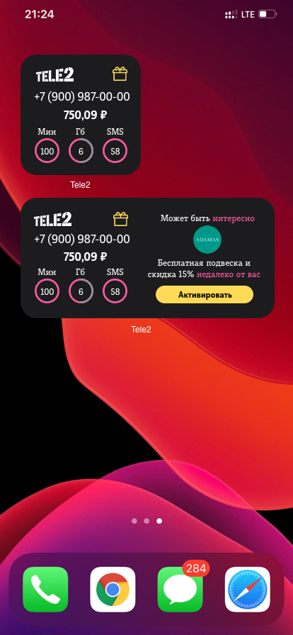

# Кодовое название "Таргет"

## Портрет Пользователя:
Вася, 26 лет. Пользуется прогрессивными средствами связи, ценит качество и комфорт использования. Не расточителен, трудолюбив. Есть работа и девушка. Вася устанавливает приложение Теле2 и хочет пользоваться плюсами и предложениями оператора, если они покажутся ему выгодными и понятными в использовании (usability).

## User Story:
Вася поставил себе виджет от Теле2, чтобы следить за своими расходами по тарифу. И в нем есть приятное дополнение - раздел «Больше».
Когда Ваня закупался продуктами в торговом центре, ему на телефон пришло push-уведомление от виджета. Текст сообщения он читать не стал, поскольку его взгляд отвлекли рабочие чаты в трее событий. Однако, когда он оказался на главном экране, увидел, что в магазине адамас в том же торговом центре он может получить бесплатный подарок - подвеску. Ваня подумал о том, что его девушке понравится небольшой подарок, потому нажал на кнопку «Активировать». Тут же на виджете появился QR-код, который Вася сразу показал кассиру в магазине Адамас, и получил свою подвеску. Вася получил подвеску и получил хороший пользовательский опыт от взаимодействия с брендом Теле2, Адамас и виджетом с onebutton-интерфейсом.

## Описание механики идеи под капотом
Мы берем "следы" пользователя, которые обычно используются для таргетированной рекламы, но предлагаем ему не бесполезные картинки, а купоны/акции/кэшбеки, которые окажутся полезны. То есть мы имеем возможность использовать геопозицию (и слать гео-пуши), знаем дату рождения (чтобы отправлять предложения покупки подарков), можем получить доступ к календарю или имеем данные тех, с кем он в "групповом тарифе" (чтобы понимать, когда день рождения у кого-то из родственников), можем ориентироваться на его поисковые запросы и т.д. 

### Почему QR-код?
Потому что это удобная технология, которая прочно вошла в повседневную жизнь. QR-код маленького размера все еще читаем, QR-код белого цвета в случае со светлой темой тоже читается, а алгоритм Рида-Соломона, испольщуемый для восстановления данных, может помочь прочитать QR-код, даже если 30% его оказалась потеряна.

### Почему не добавить эту механику в приложение?
Потому что пользователям сейчас приходит гигантское количество уведомлений, и, конечно же, они ранжируются по важности. Скорее всего при получении звукового сигнала пользователь не обратит внимание на уведомление об акции, как было в пользовательской истории. В приложение пользователи чаще всего заходят как раз, чтобы проверить баланс или остатки по пакетам и многие вообще не знают о том, что там внутри есть какие-то купоны/акции/скидки/подарки. С помощью виджета мы делаем раздел "Больше" ближе к пользователю и понятнее. 

## Конечная цель
Дать пользователям понять, что мобильный оператор Теле2 - это больше, чем просто оператор. Он выходит в оффлайн, и может помочь сэкономить и получить какую-то уникальную выгоду. Виджеты при этом будут работать, как визуальное напоминание о том, что у него есть какие-то уникальные возможности, которые "оказываются в нужное время в нужном месте". Важно сделать виджет таким образом, чтобы 

## Предварительные дизайн-макеты виджетов

### Решили отказаться от "навязчивости"

### В пользу простоты и понятности

### Как приложение выглядело

### Куда перекидывает после нажатия на виджет. Решили сделать так, потому что нельзя всю важную информацию уместить на виджете.

### Вариант кастомизации виджета пользователем

